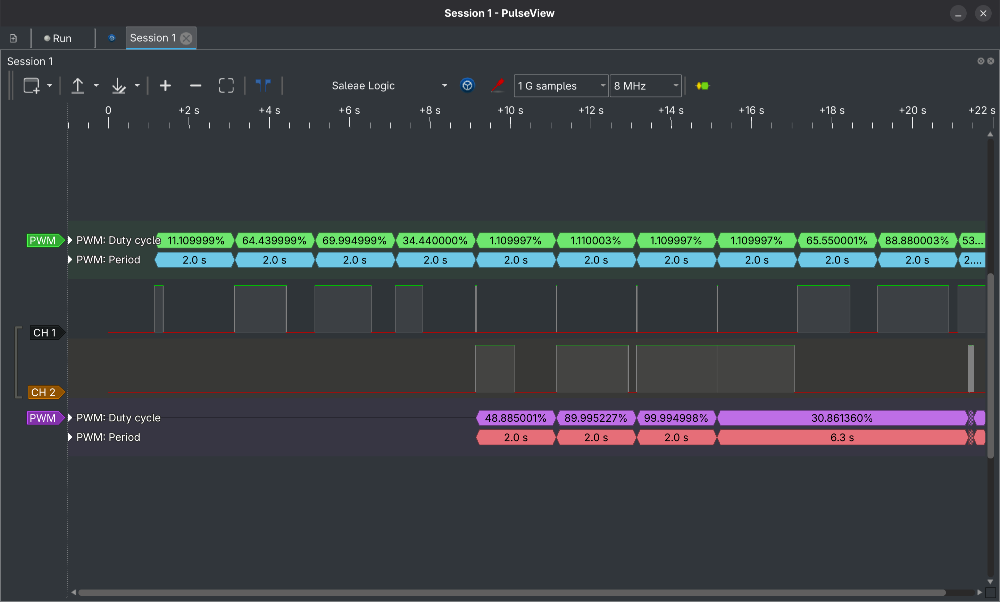
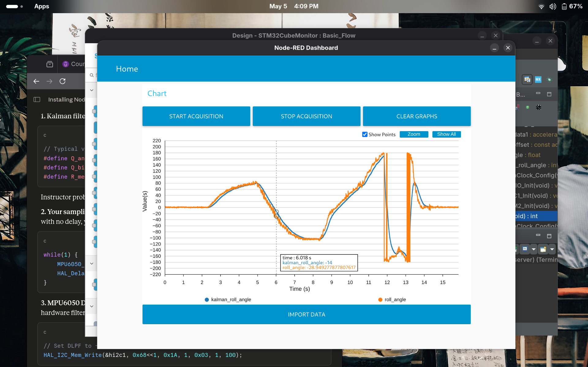
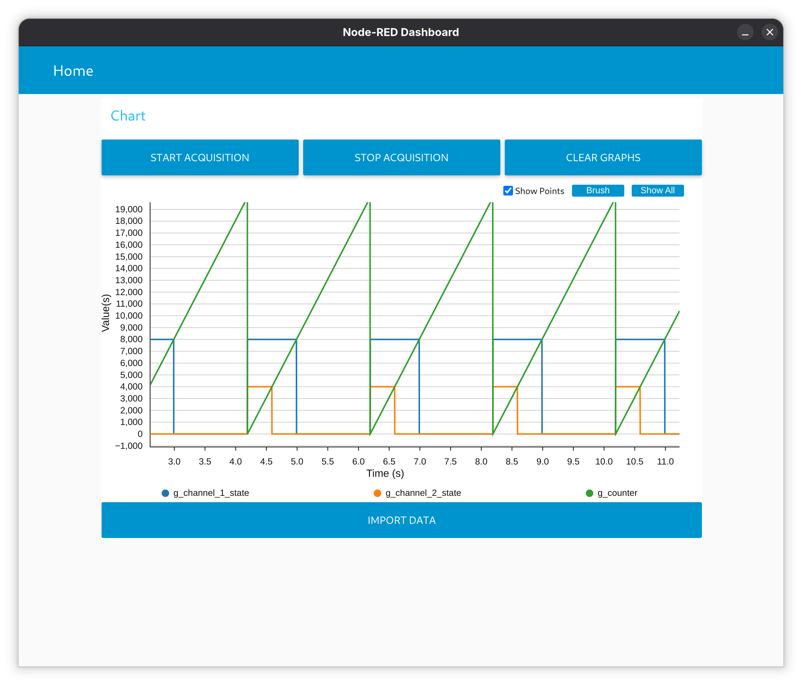
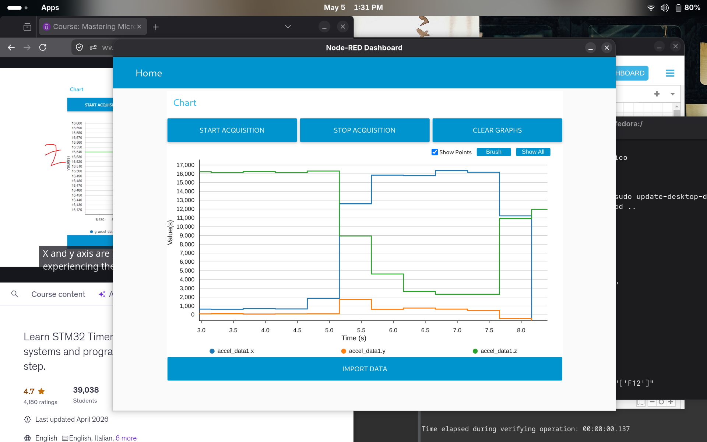

# PWM LED Control using MPU6050 + Kalman Filter

Tilt-based dual channel PWM brightness control using the MPU6050 accelerometer and a Kalman filter for angle smoothing. Tilt left increases CH2 duty cycle, tilt right increases CH1 duty cycle.


## How It Works

1. MPU6050 accelerometer data is read over I2C
2. Roll angle is computed using `atan2(Y, Z)`
3. Kalman filter smooths the noisy raw angle
4. Filtered angle is mapped to a PWM duty cycle (0–100%)
5. PWM channel is selected based on tilt direction

```
Tilt Right → TIM2 CH1 duty increases
Tilt Left  → TIM2 CH2 duty increases
Flat       → Both channels near 0%
```

## Hardware

| Component | Pin |
|-----------|-----|
| MPU6050 SCL | PB6 |
| MPU6050 SDA | PB7 |
| PWM CH1 | PA0 |
| PWM CH2 | PA1 |
| MPU6050 I2C Address | `0x68` (AD0 → GND) |


## Timer Configuration

```
TIM2 Clock     = 60MHz (APB1 × 2)
Prescaler      = 5999
Timer Tick     = 10kHz
Period         = 19999
PWM Frequency  = 0.5Hz (2.0s period)
```

## Software

| Module | Description |
|--------|-------------|
| `mpu6050.c` | I2C driver, accelerometer read, calibration, DLPF config |
| `kalman_filter.c` | 1D Kalman filter for angle smoothing |
| `app_callback.c` | TIM2 PWM and period elapsed callbacks |
| `main.c` | Angle computation, PWM mapping, main loop |

### Angle to PWM Mapping

```c
// Maps filtered roll angle (0–90°) to PWM pulse (0–19999)
uint32_t pwm_pulse = map(kalman_roll_angle, 0, 90, 0, 19999);
```

### DLPF Configuration

```c
// Hardware low pass filter at 21Hz for cleaner accelerometer data
mpu6050_config_low_pass_filter(&hi2c1, DLPF_CFG_21HZ);
```

## Output

### PulseView (Logic Analyzer Capture)

> CH1 (right tilt) and CH2 (left tilt) PWM duty cycle changing with tilt angle


### STM32CubeMonitor displaying Kalman Filter vs Raw Angle

> Blue = Kalman filtered angle, Orange = raw accelerometer angle


### STM32CubeMonitor displaying the duty cycle

> Blue = Ch 1 having 40% duty cycle, Orange = Ch 2 having 20% duty cycle


### STM32CubeMonitor displaying raw accelerometer data from the MPU6050
> This sensor is not calibrated, to see the sensor data after calibration please check the img folder


## Build & Flash

1. Open project in **STM32CubeIDE**
2. Build → Flash via ST-Link
3. Connect MPU6050 to PB6/PB7
4. Connect logic analyzer to PA0/PA1 to observe PWM output


## Notes

- Clone MPU6050 modules may require a power cycle after flashing to clear I2C bus lockup
- Accelerometer calibration offsets are hardcoded please recalibrate if sensor is replaced
